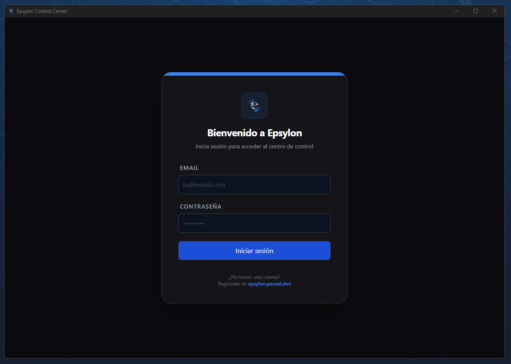

<p align="center">
  <video src="https://github.com/user-attachments/assets/105927ac-dded-4c58-8adb-c3c983dbf909" alt="video-banner">
</p>

<p align="center">
  
  
  
  
  
</p>

---

> ⚠️ **Repo de escaparate** — Este repositorio contiene únicamente documentación visual y descripción del proyecto. El código fuente es privado.

---

# 🛸 Epsylon

**Epsylon** es el asistente definitivo impulsado por IA diseñado para revolucionar tu carrera profesional. 

Combina la potencia de la automatización en la búsqueda de empleo, con la asistencia inteligente en tiempo real durante entrevistas técnicas, todo en una aplicación de escritorio discreta, potente e inteligente.

> "No solo busques trabajo. Prepárate mejor y afronta cada oportunidad con más confianza."

---

## 🖼️ Demo

<p align="center">
  
</p>

---

## 🌀 Pantalla de login Desktop

<p align="center">
 
</p>

---

## 📸 Capturas de pantalla

<table>
  <tr>
    <td align="center">
      
      <sub><b>Asistente — apoyo contextual</b></sub>
    </td>
    <td align="center">
      
      <sub><b>Empleos — búsqueda y gestión</b></sub>
    </td>
  </tr>
  <tr>
    <td align="center">
      
      <sub><b>Base de conocimiento</b></sub>
    </td>
    <td align="center">
      
      <sub><b>Ajustes — personalización</b></sub>
    </td>
  </tr>
</table>

---

<!-- SYNC:FEATURES:START -->

## 🚀 Características Principales

### 🎤 Interview Copilot (Asistencia en Tiempo Real)
*   **Cursor Virtual:** Al activarlo desde Ajustes, el cursor real del sistema queda oculto en capturas de pantalla y grabaciones. Un cursor SVG renderizado en el frontend sigue el movemento real del ratón, mostrando una posición que puede diferir de la real.
*   **Click-through Mode (Ghost):** En modo fantasma, el teleprompter mantiene click-through para no robar foco/clics durante la entrevista.
*   **Navegación de bloques en Ghost sin click:** Las sugerencias del teleprompter pueden recorrerse con hotkeys globales `←/→` incluso cuando la ventana está en click-through.
*   **Camuflaje de proceso en Windows:** Además del camuflaje de título en modo stealth (`"System Host Process"`), el build aplica metadatos Win32 (`FileDescription`, `ProductName`) al `.exe` para reducir exposición visual en Task Manager. Se aplica sobre el binario release de Tauri y sobre los `.exe` copiados a `release/local|cloud`.
*   **Detección de Plataforma:** Reconocimiento automático de Zoom, Teams y Google Meet para optimizar el contexto. 
*   **Teleprompter Remoto:** Visor con scroll automático sincronizado y controlable remotamente desde la ventana principal.
*   **Teleprompter visible en capturas (Windows):** Nuevo check en `Ajustes` para permitir o bloquear la aparición del teleprompter en screenshots/grabaciones de pantalla.
*   **Hotkeys Globales Configurables en UI:** Edita los atajos desde `Ajustes`, se aplican al instante sin rebuild y quedan persistidos para próximos arranques.
*   **Personalización del Copiloto (Inyección avanzada de contexto):** textarea en `Copiloto` que añade “background personal” (criterios, estilo, resumen propio) que el backend mezcla con los hits de KB/roles antes de generar sugerencias.
*   **Hotkeys de audio robustas:** Fallback de ejecución directa desde Tauri para captura/chunks incluso si el bus de eventos del renderer no responde.
*   **UI 100% en Español:** Etiquetas, mensajes, botones y estados unificados en un único idioma. 

### 🎭 Mock Interviews (Simulacros de Entrevista)
*   **Módulo de Práctica Interactiva:** Pestaña dedicada para realizar entrevistas de prueba con una IA que actúa como reclutador técnico.
*   **Configuración por Rol y Nivel:** Elige el puesto (ej: Senior Backend) y la empresa (ej: Google) para una experiencia personalizada.
*   **Sesiones Dinámicas:** Flujo de conversación inteligente que adapta las preguntas según el desempeño del candidato.
*   **Evaluación y Feedback Detallado:** Al finalizar, recibe una puntuación global y desglosada (técnica, comunicación, confianza) junto con fortalezas y áreas de mejora.
*   **Historial de Sesiones:** Registra y revisa tus simulacros previos para medir tu progreso en el tiempo.

### 🔍 Job Search Engine (Búsqueda Automatizada)
*   **Crawlers Multi-Fuente:** Rastreo en LinkedIn, Infojobs, WeWorkRemotely, DjangoJobs, Adzuna, TheirStack y más.
*   **Diagnóstico de Crawlers en tiempo real:** Tras cada búsqueda, la UI muestra un badge por fuente indicando cuántas ofertas encontró, si está mal configurada (⚠) o si falló (✗).
*   **UI de Ofertas compacta (v0.2.0):** Filtros reorganizados en rejilla y controles de fuentes simplificados para reducir ruido visual y mejorar la lectura operativa.
*   **Filtros Avanzados:** Filtra por salario, experiencia, ubicación y modalidad remota. El filtro de ubicación reconoce aliases internacionales (España↔Spain, Alemania↔Germany, etc.).
*   **Hasta 200 resultados por búsqueda:** Límite ampliado para aprovechar al máximo todas las fuentes activas simultáneamente.
*   **Gestión de Candidaturas:** Tracking local en SQLite (`Guardado`, `Aplicado`, `Entrevista`, `Rechazado`).
*   **Auto-Apply & Outreach:** Generación automática de cartas de presentación y correos de seguimiento personalizados.
*   **Follow-up premium (v0.2.0):** La generación de correo de seguimiento en Desktop queda disponible desde **PREMIUM/LIFETIME**.
*   **Carta de Presentación por Oferta:** Selección explícita de oferta guardada antes de generar la carta.
*   **Nota sobre fuentes:** Indeed y Glassdoor bloquean scraping público sin API key oficial. Las fuentes más fiables sin coste son LinkedIn, WeWorkRemotely, DjangoJobs y Adzuna (requiere key gratuita).

### 💳 Control de Costes API (portal TheirStack)
*   **Integración TheirStack en Modo Ahorro:** Activación manual desde UI para evitar consumo accidental.
*   **Tope por Consulta:** Máximo 5 resultados por búsqueda en TheirStack.
*   **Tope Diario Persistente:** Límite diario configurable de créditos TheirStack (por defecto: 20/día).
*   **Ventana Temporal Acotada:** Búsquedas TheirStack con antigüedad máxima configurable (`posted_at_max_age_days`).

### 💳 Billing y Membresías (Stripe)

| Característica | FREE | PRO (19€/mes) | PREMIUM (49€/mes) |
| :--- | :--- | :--- | :--- |
| **STT (Transcripción)** | 0 min | 120 min/mes | 600 min/mes |
| **Mock Interviews** | 0 | 10 sesiones/mes | 50 sesiones/mes |
| **Auto-Apply** | 0 | 50 aplicaciones/mes | 300 aplicaciones/mes |
| **Stealth Suite** | No | Básico | Completo (Win32 + Capturas) |
| **LLMs Avanzados** | No | No | Sí (OpenAI, Gemini, Claude) |
| **TheirStack API** | No | No | Habilitado |
| **Base Conocimiento** | 5 docs | 25 docs | 200 docs |

*   **Modelo de Prueba (Trial) de 3 días:** En planes **PRO** y **PREMIUM**, el checkout puede crear una suscripción en Stripe con `trial_period_days: 3` **solo si la cuenta aún no ha usado el trial de pago** (una vez en la vida por usuario). El estado `trialing` se refleja como **`trial`** en la API para desbloquear descarga y panel mientras dura la prueba.
*   **Anti-abuso trial:** Columna `paid_trial_consumed_at` en `subscriptions`. Se marca al entrar en `trialing` vía webhook; los siguientes checkouts PRO/PREMIUM van **sin** trial. `GET /billing/subscription` incluye `paidTrialEligible` para la UI.
*   **Stripe Checkout (hosted):** La web (`apps/web`) obtiene la URL de pago vía `POST /billing/checkout-session` (proxy autenticado en `/api/proxy/billing/checkout-session`) y redirige al Checkout de Stripe. Los **Price IDs** se configuran en el backend con variables `STRIPE_PRICE_*`.
*   **Webhook:** Verificación con **`stripe.webhooks.constructEvent`** y `STRIPE_WEBHOOK_SECRET`. Eventos relevantes: `checkout.session.completed` (pago único / lifetime), `customer.subscription.created` / `updated` / `deleted`, `invoice.paid` y `invoice.payment_failed`. **Idempotencia** por tabla `billing_events` (no reprocesar el mismo `event.id`).
*   **Portal de cliente:** `POST /billing/customer-portal` para gestionar facturación, planes y cancelaciones directamente en Stripe desde el panel web.
*   **Control de Descargas:** El backend bloquea el acceso al ejecutable si el usuario no tiene una suscripción válida (`active` o `trial`).
*   **Reglas de IA por plan (v0.2.0):** En endpoints de copiloto/carta (`/interview/assistant/suggest`, `/jobs/cover-letter/generate`) el backend restringe proveedores avanzados a **PREMIUM/LIFETIME**; **PRO/FREE** usan **OpenRouter**.

### 🔐 Seguridad e Infraestructura
*   **Auth lista para cloud:** Registro, login, `me`, refresh token rotatorio y logout verificados contra la API desplegada.
*   **Superuser Bypass (Dev/Personal):** Sistema de acceso total mediante la variable de entorno `SUPERUSER_EMAILS`. Los emails listados obtienen rol `admin` y suscripción Premium automática.
*   **Infra free-tier validada:** Deploy operativo sobre Render + Neon + Upstash con smoke tests reales de health, auth y billing.

### 🌐 Landing Web Premium (Next.js)
*   **Carrusel Continuo de Portales de Empleo (Crawler Logos):** Un carrusel dinámico e infinito que muestra logos vectoriales de las fuentes más populares (LinkedIn, Infojobs, Indeed, etc.) con sus colores de marca originales.
*   **Consentimiento de Cookies Inteligente:** Banner de privacidad no intrusivo persistido mediante almacenamiento local (`localStorage`) para cumplimiento normativo óptimo.
*   **Rich Aesthetics (Diseño Inmersivo):** Transición fluida entre secciones sin cortes duros, iluminaciones ambientales con orbes difusos en tonos azul/índigo, y un diseño visualmente unificado.
*   **Cards de Contenido y Tablas Premium:** Tablas de comparación con bordes suavizados (`rounded-3xl`), resplandor trasero dinámico (`glow backdrop`) y tarjetas modulares de soporte con colores de contraste balanceados.
*   **Internacionalización & UX:** Traducción total al español y enrutado SPA optimizado mediante componentes `<Link>` nativos.
*   **Auth con Clerk Personalizado:** Registro e inicio de sesión integrados con Clerk. Interfaz de usuario adaptada a modo oscuro (menús y popovers con visibilidad corregida).
*   **Landing enfocada a Conversión:** Sección de precios actualizada con los límites reales (50 Auto-Applies en Pro, Ilimitado en Premium) y llamada a la acción directa para el Trial de 3 días.
*   **Logo e Identidad:** Restauración y preservación del logo original de Epsylon en toda la plataforma.
*   **Descarga del instalador Windows:** Desde el panel `/app`, enlace a `/api/download` solo para usuarios Clerk con suscripción `active` o `trial`; el servidor valida contra el API y rechaza placeholders o instaladores corruptos (tamaño mínimo).
*   **Contraseña del escritorio desde la web:** En el panel se puede fijar la contraseña del API usada en el login del Tauri (independiente de Clerk), vía proxy autenticado hacia `POST /auth/desktop-password`.

### 🧠 Inteligencia Avanzada
*   **OCR Inteligente con Auto-Sugerencia:** Soporte mixto `spa+eng` con carga de imágenes o pegado directo desde el portapapeles. Al detectar texto, el sistema dispara automáticamente la generación de sugerencias IA. 
*   **TTS (Text-To-Speech):** Escucha las sugerencias de la IA a través de tus auriculares.
*   **Memoria de Entrevista por Rol y Nivel:** Base general común + memoria específica para Backend, Java, Spring Boot, Full Stack y niveles Mid / Mid-Adv.
*   **Base de Conocimiento Local (PDF/TXT):** Ingesta, búsqueda, listado, reindexado y borrado de documentos desde la app.
*   **Pestaña dedicada de KB:** La gestión de la base de conocimiento vive en una pestaña/sección separada (`Base de conocimiento`) con una interfaz optimizada que incluye filtrado en tiempo real y una vista compacta basada en tablas para documentos y resultados.
*   **Trazabilidad de contexto:** Las sugerencias pueden devolver `knowledgeHits` para ver qué fragmentos KB se usaron.
*   **Wizard BYOK de OpenRouter en Ajustes:** El usuario puede crear cuenta, generar su API key, verificarla y guardarla desde un flujo guiado de 3 pasos.
*   **Clave del usuario como preferente:** Si el usuario guarda su OpenRouter API key, se usa por defecto en sugerencias, cover letters y follow-up emails; si no existe, el backend usa la clave base del sistema.
*   **Groq STT BYOK (opcional) en Ajustes:** Campo dedicado para guardar una clave de Groq en el equipo. Solo se envía al backend en peticiones de transcripción (`POST /interview/stt/transcribe`) mediante la cabecera `X-Groq-Api-Key`. Útil cuando la API desplegada no define `GROQ_API_KEY` o quieres consumir cuota propia sin tocar el servidor.
*   **Analíticas:** Visualiza tu progreso con dashboards de búsqueda y éxito en entrevistas.

### ⚡ Rendimiento y Operación
*   **Arquitectura Modular:** Componentes críticos como el `TeleprompterView`, `useDiscreetMode` y utilidades de procesamiento han sido extraídos de la vista principal para mejorar la mantenibilidad y el rendimiento del renderizado.
*   **Compresión HTTP:** API Fastify con compresión global para respuestas grandes.
*   **Carga Diferida de OCR:** `tesseract.js` se carga solo cuando se usa OCR (mejor arranque de API).
*   **Índices en Persistencia Local:** SQLite para jobs + SQLite FTS5 para chunks KB + índice Q/A dedicado para recuperación más precisa.
*   **Análisis de Bundle Desktop:** Script para inspeccionar tamaño y composición del bundle de renderer.
*   **Observabilidad:** Logs estructurados ultra-rápidos con `pino` y visualización legible en desarrollo con `pino-pretty`.
*   **Documentación Interactiva:** Endpoints del backend auto-documentados vía Swagger UI (`/docs`).
*   **Tests Unitarios e Integración:** Suite de pruebas automatizada para componentes críticos, utilidades y servicios del backend, garantizando estabilidad ante cambios.
*   **CI/CD Automatizado:** Pipeline en GitHub Actions configurado para compilar y publicar releases (Tauri y Backend) de forma inteligente (bajo demanda o por tags) ahorrando minutos de ejecución.

---

## 🖼️ Infografia del Proyecto

<details>
  <summary>Ver infografia del proyecto</summary>
  <br />
  <p align="center">
    
  </p>
</details>

<!-- SYNC:FEATURES:END -->

---

<!-- SYNC:FEATURES:END -->
<details>
  <summary>Ver infografia del proyecto</summary>
  <br />
  <p align="center">
    
  </p>
</details>

---

<!-- SYNC:FEATURES:END -->
<details>
  <summary>Ver infografia del proyecto</summary>
  <br />
  <p align="center">
    
  </p>
</details>

---

<!-- SYNC:FEATURES:END -->

## ⚠️ Nota de Uso

Epsylon es una herramienta de apoyo y entrenamiento. Su objetivo es ayudar a los usuarios a prepararse y mejorar sus habilidades profesionales.

**No sustituye el conocimiento ni el desempeño individual del usuario en procesos reales**.

---

## 🛠️ Stack Tecnológico

| Capa | Tecnologías |
| :--- | :--- |
| Desktop | Tauri, React, TypeScript |
| Backend | Node.js, Fastify |
| IA | OpenAI, Gemini, OpenRouter |
| Persistencia | SQLite, PostgreSQL |
| Web | Next.js |

---

## 📂 Estructura del Proyecto

```text
Epsylon/
├── apps/
│   ├── api/
│   └── desktop/
├── packages/
│   └── shared/
├── docs/
├── assets/
└── docker-compose.yml
```

---

## 📬 Contacto

¿Interesado en el proyecto?

- 📧 pacoaldev@gmail.com
- 🌐 [Portfolio](https://pacoal.dev)

---

## 📄 Licencia

Código fuente bajo licencia **All Rights Reserved**.
Este repositorio de escaparate es público solo con fines de presentación para el proyecto Epsylon.
