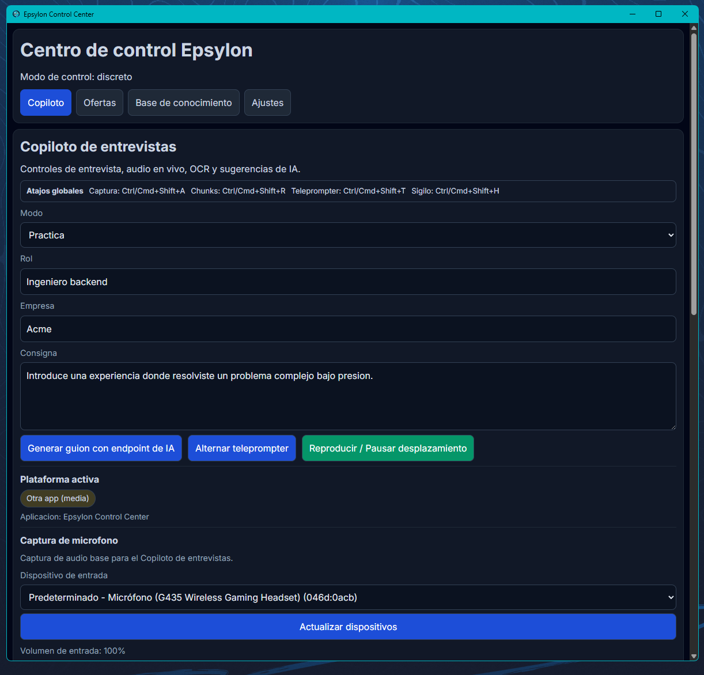
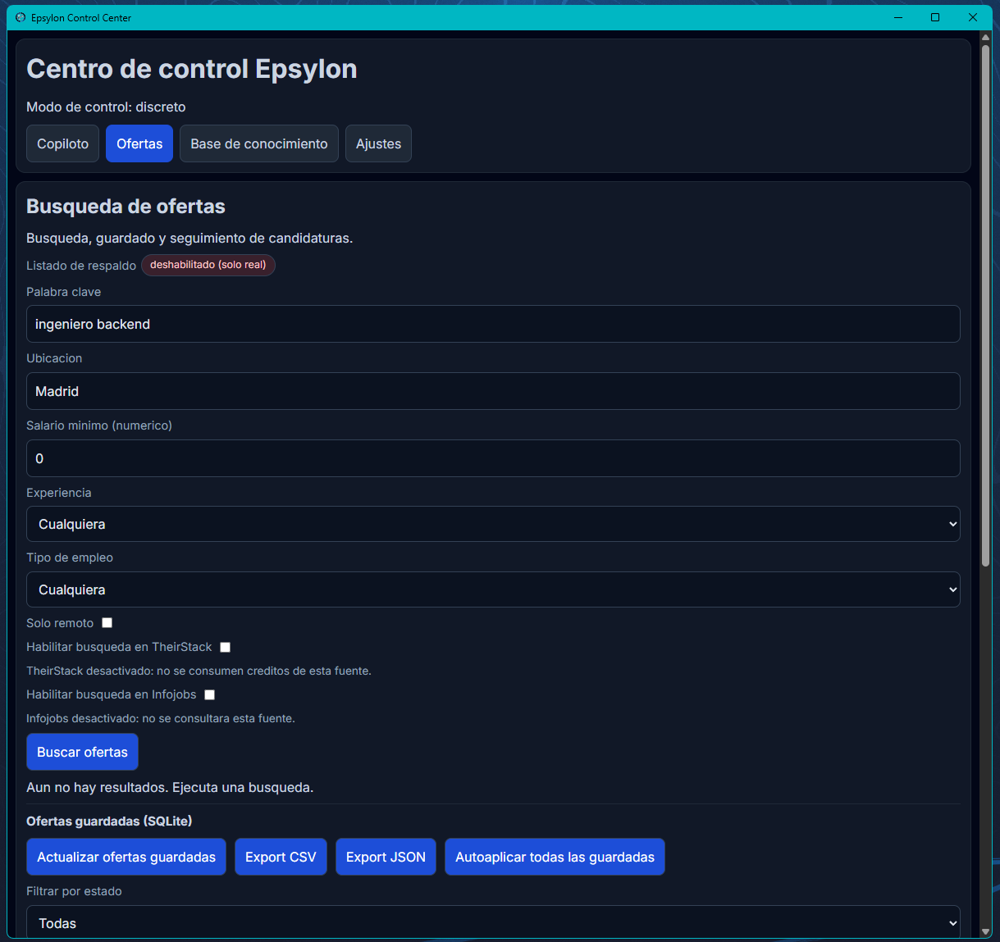
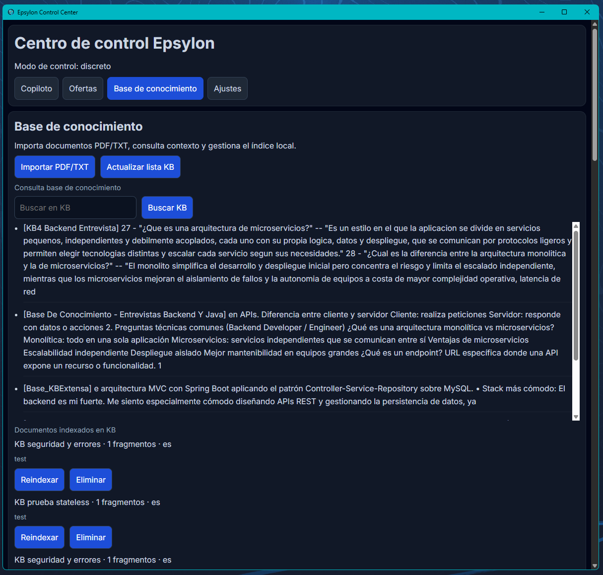
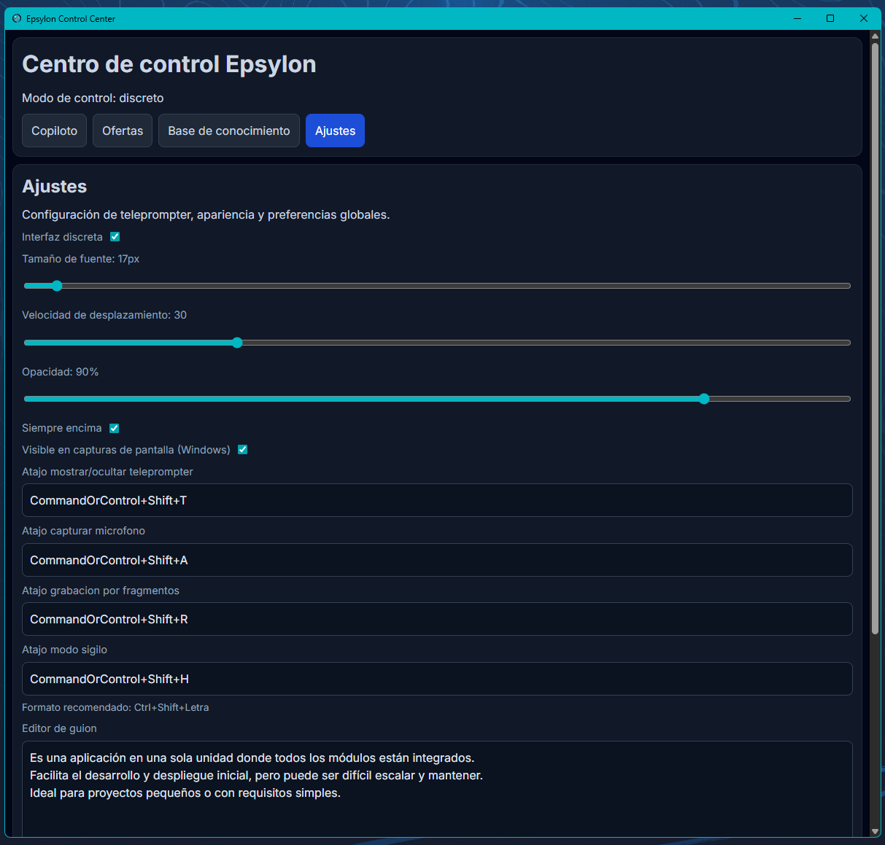

<p align="center">
  <video src="https://github.com/user-attachments/assets/105927ac-dded-4c58-8adb-c3c983dbf909" alt="video-banner">
</p>

<p align="center">
  
  
  
  
  
</p>

---

> ⚠️ **Repo de escaparate** — Este repositorio contiene únicamente documentación visual y descripción del proyecto. El código fuente es privado.

---

# 🛸 Epsylon

**Epsylon** es una plataforma de apoyo profesional impulsada por IA diseñada para ayudarte a prepararte, practicar y mejorar tu rendimiento en procesos de selección técnica.

Combina herramientas de simulación de entrevistas, asistencia contextual y automatización en la búsqueda de empleo en una aplicación moderna, potente y fácil de usar.

> "No solo busques trabajo. Prepárate mejor y afronta cada oportunidad con más confianza."

---

## 🖼️ Demo

<p align="center">
  
</p>

---

## 📸 Capturas de pantalla

<table>
  <tr>
    <td align="center">
      
      <sub><b>Asistente — apoyo contextual</b></sub>
    </td>
    <td align="center">
      
      <sub><b>Empleos — búsqueda y gestión</b></sub>
    </td>
  </tr>
  <tr>
    <td align="center">
      
      <sub><b>Base de conocimiento</b></sub>
    </td>
    <td align="center">
      
      <sub><b>Ajustes — personalización</b></sub>
    </td>
  </tr>
</table>

---

## 🚀 Características Principales

### 🎤 Asistente de Entrevistas (Preparación y Apoyo)
*   **Sugerencias Contextuales:** Recibe ideas, estructuras de respuesta y puntos clave mientras practicas entrevistas.
*   **Teleprompter Inteligente:** Visualiza respuestas sugeridas para mejorar claridad y comunicación.
*   **Compatibilidad con videollamadas:** Adaptación de contexto según plataformas como Zoom, Teams o Meet.
*   **Control por Hotkeys:** Navegación rápida sin interrumpir el flujo de práctica.
*   **Personalización del asistente:** Añade tu perfil, experiencia y objetivos para recomendaciones más precisas.
*   **Interfaz optimizada:** Diseño centrado en claridad, velocidad y facilidad de uso.

---

### 🎭 Mock Interviews (Simulacros de Entrevista)
*   **Entrevistas simuladas con IA:** Entrena con un sistema que actúa como entrevistador técnico.
*   **Configuración por rol y nivel:** Ajusta dificultad y especialización.
*   **Feedback detallado:** Evaluación técnica, comunicación y claridad.
*   **Historial de sesiones:** Seguimiento de tu progreso.

---

### 🔍 Job Search Engine (Búsqueda de Empleo)
*   **Agregación de ofertas:** Integración con múltiples plataformas.
*   **Filtros avanzados:** Ubicación, salario, modalidad y experiencia.
*   **Gestión de candidaturas:** Organización del estado de tus aplicaciones.
*   **Asistencia en contenido:** Generación de cartas de presentación y mensajes de seguimiento.

---

### 💳 Billing y Membresías (Stripe)
*   **Planes por suscripción:** Acceso a funcionalidades avanzadas mediante planes PRO y PREMIUM.
*   **Periodo de prueba:** Posibilidad de evaluar la plataforma antes de suscribirse.
*   **Gestión de suscripción:** Sincronización con Stripe para control de estado del usuario.
*   **Portal de cliente:** Gestión de pagos, cancelaciones y facturación.
*   **Control de acceso:** Funcionalidades habilitadas según estado de suscripción.

---

### 🧠 Inteligencia Avanzada
*   **Procesamiento de texto e imagen:** Extracción de información relevante.
*   **Base de conocimiento personal:** Importa documentos para enriquecer respuestas.
*   **Sugerencias personalizadas:** Basadas en perfil, rol y contexto.
*   **TTS (Text-To-Speech):** Escucha sugerencias para reforzar el aprendizaje.

---

### 🔐 Seguridad e Infraestructura
*   **Autenticación segura:** Gestión de usuarios y sesiones.
*   **Infraestructura escalable:** Preparada para despliegue en cloud.
*   **Protección de datos:** Manejo seguro de la información.

---

### 🌐 Plataforma Web
*   **Landing optimizada:** Enfocada en claridad y conversión.
*   **Autenticación integrada:** Registro e inicio de sesión.
*   **Experiencia moderna:** Diseño limpio y responsive.

---

### ⚡ Rendimiento y Arquitectura
*   **Arquitectura modular:** Escalable y mantenible.
*   **Optimización de recursos:** Carga bajo demanda.
*   **Persistencia eficiente:** SQLite + PostgreSQL.
*   **Observabilidad y testing:** Logs, métricas y pruebas automatizadas.

---

## 🧠 Objetivo del Proyecto

Epsylon está diseñado para:

- Mejorar la preparación en entrevistas técnicas.
- Aumentar la confianza del candidato.
- Optimizar la búsqueda de empleo.
- Proporcionar herramientas prácticas de entrenamiento profesional.

---

## ⚠️ Nota de Uso

Epsylon es una herramienta de apoyo y entrenamiento. Su objetivo es ayudar a los usuarios a prepararse y mejorar sus habilidades profesionales.

**No sustituye el conocimiento ni el desempeño individual del usuario en procesos reales**.

---

## 🛠️ Stack Tecnológico

| Capa | Tecnologías |
| :--- | :--- |
| Desktop | Tauri, React, TypeScript |
| Backend | Node.js, Fastify |
| IA | OpenAI, Gemini, OpenRouter |
| Persistencia | SQLite, PostgreSQL |
| Web | Next.js |

---

## 📂 Estructura del Proyecto

```text
Epsylon/
├── apps/
│   ├── api/
│   └── desktop/
├── packages/
│   └── shared/
├── docs/
├── assets/
└── docker-compose.yml
```

---

## 📬 Contacto

¿Interesado en el proyecto?

- 📧 pacoaldev@gmail.com
- 🌐 [Portfolio](https://pacoal.dev)

---

## 📄 Licencia

Código fuente bajo licencia **All Rights Reserved**.
Este repositorio de escaparate es público solo con fines de presentación para el proyecto Epsylon.