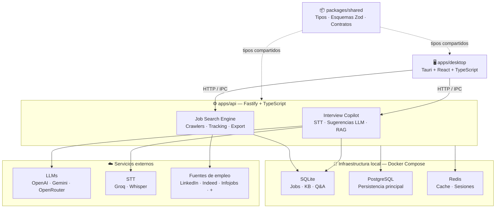
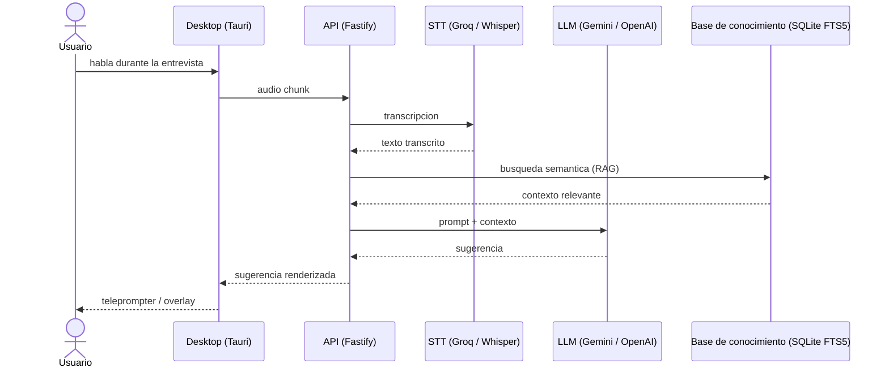
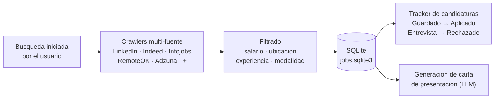
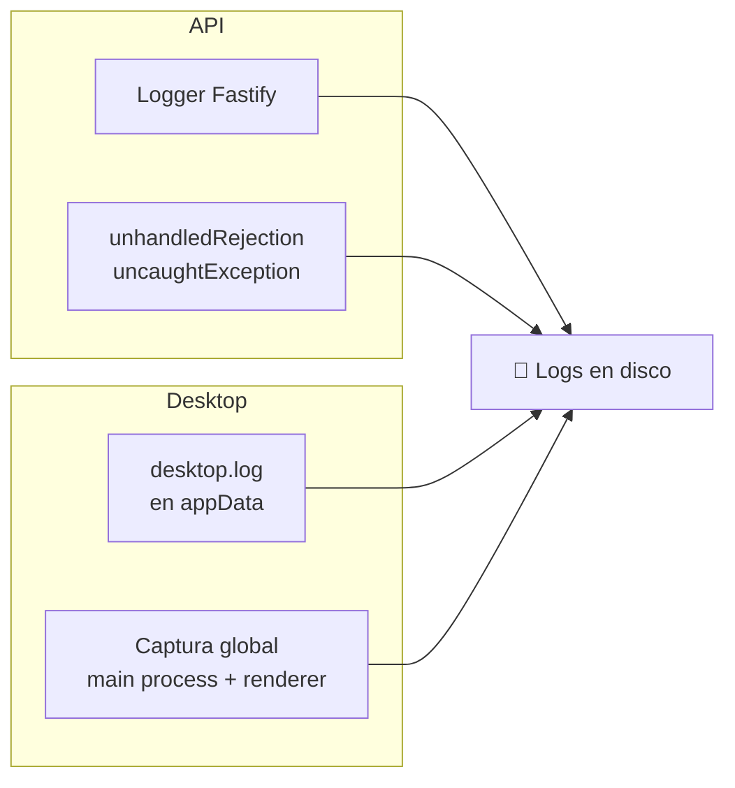
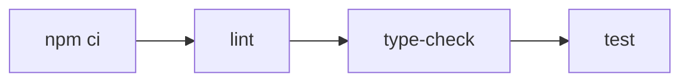

# Arquitectura tecnica — Epsylon

Epsylon es un monorepo Node.js con tres piezas principales que se comunican de forma clara y desacoplada.

---

## Estructura del monorepo

```text
Epsylon/
├── apps/
│   ├── api/         → endpoints, logica de negocio, crawlers, IA
│   └── desktop/     → UI React + shell de escritorio Tauri
└── packages/
    └── shared/      → tipos, esquemas Zod y contratos compartidos
```

---

## Flujo general del sistema



---

## Interview copilot — flujo detallado



---

## Job search engine — flujo detallado



---

## Infraestructura local

Docker Compose levanta tres servicios:

| Servicio | Tecnologia | Proposito |
| :--- | :--- | :--- |
| `api` | Node.js | Logica de negocio y endpoints |
| `postgres` | PostgreSQL | Persistencia principal |
| `redis` | Redis | Cache y sesiones |

La persistencia de jobs y la base de conocimiento se gestionan en SQLite directamente en `apps/api/data/`.

---

## Observabilidad



---

## CI/CD

El pipeline de GitHub Actions ejecuta en cada push:



---

## Proximos pasos arquitectonicos

- **Anti-bot:** definir estrategia de endurecimiento para los conectores de empleo
- **Multiusuario:** migrar tracking de jobs al esquema principal de PostgreSQL
- **Telemetria:** calidad de resultados por fuente de empleo
- **Release Tauri:** firmado de binarios, sistema de actualizaciones y observabilidad en produccion
